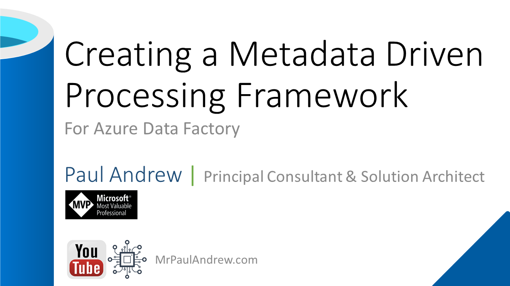

# Welcome to the Orchestrate .procfwk Home Page

This site provides details on the latest version of the processing framework ([procfwk](https://github.com/mrpaulandrew/procfwk){:target="_blank"}) code project, available on GitHub [here](https://github.com/mrpaulandrew/procfwk){:target="_blank"}, as a single source of all information needed to use and support this solution.

Please use the [Contents](/procfwk/contents) page, also available in the side bar, to navigate.

___

## Code Project Overview

### What is procfwk?

{:target="_blank" style="float: right;margin-left: 10px; width: 120px;"}This open source code project delivers a simple metadata driven processing framework for Azure Data Factory and/or Azure Synapse Analytics (Intergate Pipelines). The framework is made possible by coupling the orchestration service with a SQL Database that houses execution batches, execution stages and pipeline metadata that is later called using an Azure Functions App. The execution batch, stage and worker pipeline structures allow; concurrent overall batch handling with inner stages of process dependencies executed in sequence. Then at the lowest level, all worker pipelines within a stage to be executed in parallel offering scaled out control flows where no inter-dependencies exist.

The framework is designed to integrate with any existing set of modular processing pipelines by making the lowest level executor a stand alone worker pipeline that is wrapped in a higher level of controlled (sequential) dependencies. This level of abstraction means operationally nothing about the monitoring of the orchestration processes is hidden in multiple levels of dynamic activity calls. Instead, everything from the processing pipeline doing the work (the Worker) can be inspected using out-of-the-box Azure monitoring features.

{:target="_blank"}

This framework can also be used in any Azure Tenant and allows the creation of complex control flows across multiple orchestartion resources and even across Azure Tenant/Subscriptions by connecting Service Principal details through metadata to targeted Tenants > Subscriptions > Resource Groups > Orchestartion Services and Pipelines, this offers granular administration over any data processing components in a given environment from a single point of easily controlled metadata.

### Why use procfwk?

To answer the question of why use a metadata driven framework, please see the following YouTube video.

{:target="_blank"}

___

## Framework Capabilities

 * Interchangeable orchestration services.
   * Azure Data Factory
   * Azure Synapse Analytics (Intergate Pipelines)
 * Granular metadata control.
 * Metadata integrity checking.
 * Global properties.
 * Complete pipeline dependency chains.
 * Batch executions (hourly/daily/monthly).
 * Execution restart-ability.
 * Parallel pipeline execution.
 * Full execution and error logs.
 * Operational dashboards.
 * Low cost orchestration.
 * Disconnection between framework and Worker pipelines.
 * Cross Tenant/Subscription/orchestrator control flows.
 * Pipeline parameter support.
 * Simple troubleshooting.
 * Easy deployment.
 * Email alerting.
 * Automated testing.
 * Azure Key Vault integration.
 * Is pipeline already running checks.

___

## Deployment Steps

For details on how to deploy the processing framework to your Azure Tenant see [Deploying ProcFwk](/procfwk/deployprocfwk).

___

## Complete Orchestrator Activity Chain

The following offers a view of all pipeline activities at every level within the processing framework if flattened out onto a single canvas. This applies regardless of the orchestrator type.

{:target="_blank"}

___