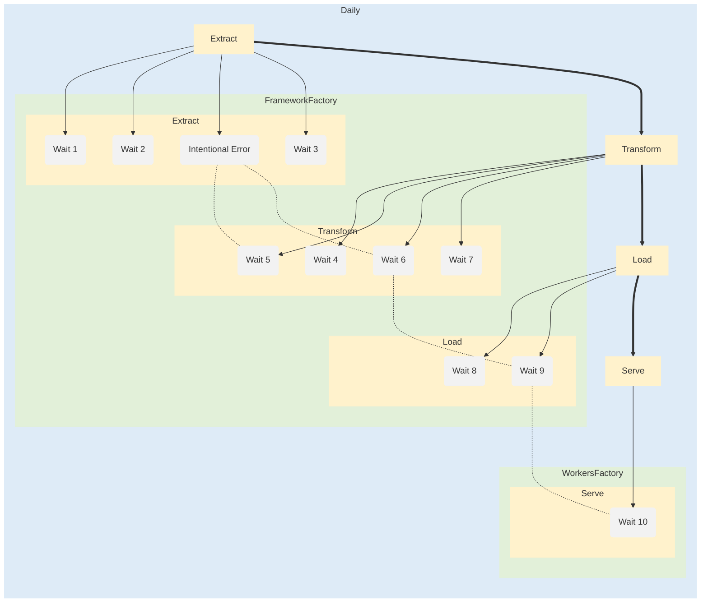

# Pipeline Lineage

___
[<< Contents](/procfwk/contents) 

___

To support and inform operational teams working with the processing framework solution pipeline lineage documentation and diagrams can be auto generated from the metadata database.

This can be done using the Markdown extention Mermaid.

https://mermaid-js.github.io/mermaid

To generate the Mermaid markdown, within the framework metadata database the following stored procedure can be used.

```sql
EXEC [procfwkHelpers].[GetMermaidPipelineLineageMarkdown]
	@BatchName = 'Daily' --optional
```

Within a markdown rendering service the Mermaid output can then be used to generated a pipeline lineage diagram similar to the below.


